# 👨‍💻 Amine Habchi

<div align="center">

**🚀 Full Stack Developer**

📍 Casablanca / Oujda, Morocco | 🎓 Zone01 Oujda

[](mailto:amine.habchi.01@gmail.com)
[](https://www.linkedin.com/in/amine-habchi-1a9aa4237/)

</div>

---

## 🌟 About Me

```text
Passionate developer who loves building interactive applications 
and exploring different programming paradigms.
```

## 🛠️ Tech Stack

### 💻 Languages


### 🔧 Tools & Technologies


## 📊 Quick Facts

<table>
<tr>
<td width="50%">

### 🎯 Achievements
- ✅ **500+** LeetCode problems solved
- 🚀 Building scalable applications
- 🎯 Clean code advocate
- 🌱 Continuous learner

</td>
<td width="50%">

### 🔥 Focus Areas
- 🎮 **Game Development**
- 🌐 **Web Development** 
- 🔧 **System Programming**
- 🧩 **Algorithms**

</td>
</tr>
</table>

## 🎓 Currently Learning

```mermaid
graph LR
    A[🦀 Advanced Rust] --> B[🐳 Docker]
    B --> C[🔧 Go Backend]
    C --> D[🏗️ System Design]
    D --> E[🌍 Open Source]
```



- 🦀 Advanced Rust programming
- 🐳 Docker containerization  
- 🔧 Backend development with Go
- 🏗️ System design and architecture
- 🌍 Open-source contributions

---

<div align="center">

### 💡 *"Always ready for new challenges and collaborative projects!"*


</div>
